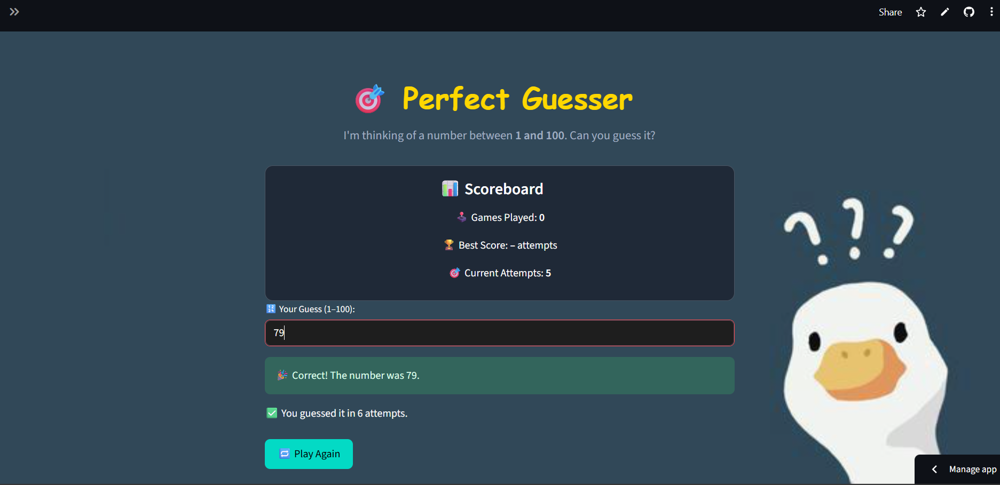

# 🎯 Perfect Guesser

Welcome to **Perfect Guesser** – a fun little game where you try to guess the number the computer is thinking of between **1 and 100**. Sounds easy? Let’s see how quickly you can crack it! 😄

🚀 [Click here to play the game live](https://perfect-guesser-bykinjal.streamlit.app/)

---

## 🕹️ How to Play

- I'm thinking of a number between **1 and 100**.
- You enter a number and press **Enter**.
- I’ll tell you if your guess is **too high** or **too low**.
- Try to guess it in the **fewest attempts possible**!
- You’ll get a 🎉 celebration if you win!

---

## ✨ Features

- 🎨 Beautiful dark-themed UI with lavender + custom background
- 📊 Scoreboard: Tracks best score, games played, and current attempts
- 🧠 Smart feedback: tells you if the number is higher or lower
- 🎈 Balloons when you win!
- 🔁 "Play Again" button resets the game instantly

---

## 🖼️ Preview



---

## ⚙️ Tech Stack

- `Python`
- `Streamlit`
- `HTML & CSS` (for styling via `st.markdown`)
- 💡 No ML, just good old logic and fun!

---
## 🧑‍💻 Made By

**Kinjal**  
📧 [kkinjal_be23@thapar.edu](mailto:kkinjal_be23@thapar.edu)  
🔗 [LinkedIn](https://www.linkedin.com/in/kinjal-tiet/)  
💻 [Streamlit App](https://perfect-guesser-bykinjal.streamlit.app/)
- - -
## 🧪 Run Locally

### Step 1: Clone the repository
```bash
git clone https://github.com/your-username/perfect-guesser.git
cd perfect-guesser

